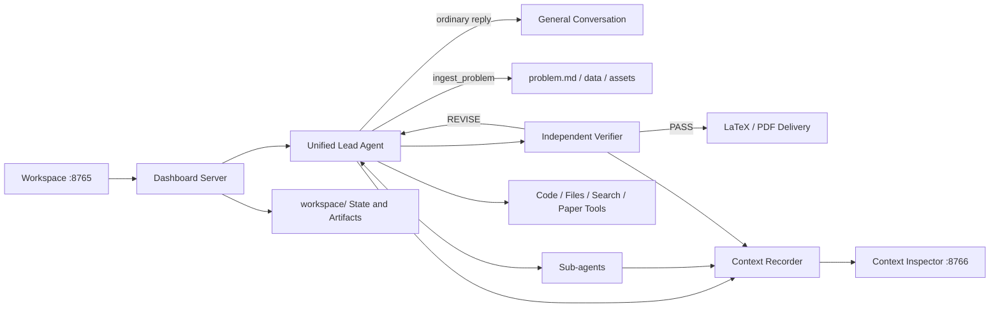

# Open Math Model Agent

**English** | [简体中文](README.zh-CN.md) | [Website](https://mathemodel.com/)

Open Math Model Agent is a local-first workspace for mathematical modeling. Give it a problem and supporting materials, and it can analyze the task, build and test models, write a paper, verify the result, and deliver the final PDF.

<p align="center">
  <a href="https://mathemodel.com/"></a>
</p>

<p align="center">
  
  
</p>

Try the hosted experience at **[mathemodel.com](https://mathemodel.com/)**, or follow the instructions below to run the complete workspace locally.

## Highlights

- A focused conversational workspace for modeling tasks, materials, decisions, progress, and deliverables.
- File-based problem intake for PDF, Word, Excel, CSV, Markdown, text, and image materials.
- Collaboration between a lead Agent and delegated sub-agents for modeling, coding, research, and writing.
- An independent verification loop that returns evidence and revision requests before delivery.
- Resumable conversations, bilingual UI, context inspection, and token/cost tracking.

## How it works



## Core Agent features

### Asynchronous Lead/Sub-agent collaboration

`spawn_subagent` starts a bounded task in the background and returns a handle immediately. Independent modeling, coding, search, or simulation tasks can therefore run concurrently in isolated Agent contexts while sharing only durable files such as `results/`, `figures/`, and `src/` with the Lead Agent.

The Lead Agent does not have to wait for the slowest worker. `collect_subagent_results(mode="first_completed")` returns as soon as one new result is available and also reports every Sub-agent still running together with its assigned task. The Lead can inspect the first result, update the plan, or continue integration while the remaining workers run. `all_completed` is required only before final synthesis and delivery. This keeps Sub-agent debugging traces out of the Lead context while preserving asynchronous progress.

### Durable Todo plan and decision state

The modeling plan is a structured Todo list stored in `plan.json`, with a human-readable `plan.md` mirror for the dashboard. `plan_write` creates or restructures the task list; `set_task_status` updates one task atomically instead of forcing the Agent to rewrite the entire plan. Important assumptions, abandoned approaches, and decisions are appended to `decisions.md` so they survive context compaction and interruption.

The Plan itself is live mutable state; the model transcript is not rewritten when the Plan changes. Its latest materialized state is propagated through a newly appended Working Memory snapshot.

### Append-only Working Memory protocol

In `append_only` mode, the second system message is an immutable protocol that defines how later memory entries must be interpreted. When the durable Plan, decisions, result index, or figure index changes, the runtime computes a state digest and appends a versioned, complete Working Memory snapshot at the end of the transcript. Existing protocol and snapshot messages are never edited, and no snapshot is inserted inside an unfinished Tool Call/Tool Result batch.

Each snapshot records its epoch, version, SHA-256 digest, and the version it supersedes. Compaction starts a new epoch and materializes one fresh snapshot. This design makes interruption recovery deterministic and keeps the early request prefix stable for provider-side caching. In the current 2023 MCM A experiment, append-only memory reached an 88.8% cache-hit rate versus 79.6% for replace-in-place memory. The full contract is documented in [`docs/working-memory-protocol.md`](docs/working-memory-protocol.md).

### Long-running tool liveness and failure recovery

Model requests and tools emit durable heartbeat events every 30 seconds without adding heartbeat text to the model context. The dashboard uses a five-minute stale threshold, but a live worker lease or recent heartbeat keeps a legitimate multi-hour computation in the `running` state.

`run_code` supports a wall-clock limit of up to 7,200 seconds. Docker enforces the limit inside the container, while the host polls the process and shared cancellation flag every 0.25 seconds. A timeout or user stop kills both the host process group and the named container. The result is returned as a normal Tool Result with `exit_code`, `timed_out`, duration, stdout/stderr tail, and a path to the full log; a tool timeout does not mark the entire conversation as failed, so the Lead Agent can diagnose the failure and choose another action. Uncaught tool exceptions are likewise converted into explicit error observations instead of crashing the Agent loop.

The session is persisted before each model request and after tool-result batches. If the dashboard process or machine fails completely, the in-flight Agent cannot continue automatically, but startup reconciliation marks the lost worker explicitly, removes only Docker containers labelled as belonging to that conversation, and preserves the last durable session boundary for a later continuation.

### Evidence-oriented paper delivery and independent verification

Computed claims are written to structured `results/` files, final reproducible code is kept under `src/`, and paper figures and LaTeX remain linked to those artifacts. Before delivery, an independent Verifier can inspect the original problem, source, numerical outputs, figures, and candidate paper. A failed verdict returns structured evidence and repair instructions to the Lead Agent for another revision instead of silently accepting self-evaluation.

## Requirements

- Python 3.11 or later
- Docker Desktop, used to isolate Agent-generated code
- [Tectonic](https://tectonic-typesetting.github.io/), used to compile LaTeX papers into PDF
- Node.js 20+ and pnpm only when modifying the frontend; compiled static assets are included in the repository

## Quick start

### 1. Clone and install

```bash
git clone git@github.com:patrlean/open-math-model-agent.git
cd open-math-model-agent

python3 -m venv .venv
source .venv/bin/activate
pip install -r requirements.txt
cp .env.example .env
```

Add at least one model provider API key to `.env`. DeepSeek is the default provider:

```dotenv
DEEPSEEK_API_KEY=your_api_key
```

### 2. Build the code sandbox

```bash
docker build -t mathmodel-sandbox:latest mathmodel/sandbox
```

The sandbox disables network access by default and applies resource limits to Agent-generated modeling code.

### 3. Start the workspace

```bash
source .venv/bin/activate
python -m mathmodel.dashboard.server --port 8765
```

Open [http://127.0.0.1:8765](http://127.0.0.1:8765).

### 4. Start the Context Inspector

In another terminal:

```bash
source .venv/bin/activate
python -m mathmodel.context_inspector.server --port 8766
```

Open [http://127.0.0.1:8766](http://127.0.0.1:8766). It shows the context sent to the model, grouped into:

1. System Prompt
2. Working Memory Protocol and versioned snapshots
3. Available Tool Definitions
4. User Input
5. Assistant Response / Tool Call / Tool Result

Context logs may contain complete problems, user input, tool arguments, and model responses. Treat them as sensitive data and do not share them publicly.

The default `append_only` Working Memory mode preserves an immutable protocol
and appends a full snapshot only when durable state changes. See
[`docs/working-memory-protocol.md`](docs/working-memory-protocol.md); set
`context.working_memory_mode: replace` for the legacy comparison group.

## Model providers

Use **Settings** in the lower-left corner to configure the provider, Base URL, and API key. For DeepSeek, choose Flash/Pro and Low/High/Max thinking effort beside the composer send button. Keys are stored in `.env`; provider metadata is stored in `.provider-settings.json`. Neither file is committed to Git.

| Provider | Default model | Default Base URL | Environment variable |
| --- | --- | --- | --- |
| DeepSeek | `deepseek-v4-flash` (default) / `deepseek-v4-pro` | `https://api.deepseek.com` | `DEEPSEEK_API_KEY` |
| Kimi | `kimi-k2.6` | `https://api.moonshot.cn/v1` | `KIMI_API_KEY` |
| MiniMax | `MiniMax-M2.7` | `https://api.minimaxi.com/v1` | `MINIMAX_API_KEY` |
| OpenAI-compatible | Custom | Custom | `OPENAI_COMPATIBLE_API_KEY` |

Web search uses Brave Search when `BRAVE_SEARCH_API_KEY` is configured and falls back to DuckDuckGo HTML search otherwise.

Image materials are inspected through the lead Agent's `describe_image` tool,
which uses `kimi-k3`. Configure `MOONSHOT_API_KEY`; its cache-hit input,
cache-miss input, output tokens, and CNY cost are included in the conversation
usage and revision budget. Tool model and limits are configured under `vision`
in `config.yaml`.

## Inputs and conversation artifacts

Each modeling conversation gets an isolated workspace:

```text
workspace/<conversation-id>/
├── problem.md
├── data/
├── assets/
├── figures/
├── results/
├── paper/
│   ├── main.tex
│   └── main.pdf
├── events.jsonl
├── context_requests.jsonl
└── session_state.json
```

- Text is extracted from PDFs, and embedded images are saved to `assets/`.
- Excel worksheets are normalized to CSV for the Agent and code sandbox.
- Image materials are preserved as-is, but a text-only model cannot interpret them automatically. Add OCR or a vision processor when needed.
- `workspace/` contains local conversations, source materials, and generated artifacts, and is excluded by `.gitignore`.

## Configuration

Global defaults live in [`config.yaml`](config.yaml):

| Section | Purpose |
| --- | --- |
| `provider` / `model` / `base_url` | Default model service |
| `context` | Context compression thresholds and token sources |
| `pricing` | Cached input, uncached input, and output token prices |
| `web_search` | Search provider, result count, and timeout |
| `verification` | Verification toggle, attempt limit, and verification/revision step limits |
| `paper` | Target pages, accepted page range, abstract, and equation requirements |
| `sandbox` | Code execution backend |

The default paper target is 20 pages, with 17–20 pages accepted. Conversation-level settings in the UI override global defaults.

## Frontend development

The frontend source is in `mathmodel/dashboard/frontend/` and includes the main workspace and Context Inspector entry points:

```bash
corepack enable
pnpm --dir mathmodel/dashboard/frontend install --frozen-lockfile
pnpm --dir mathmodel/dashboard/frontend build
pnpm --dir mathmodel/dashboard/frontend exec vite build --config vite.experiment.config.ts
```

The first build produces the main workspace and Context Inspector; the second produces the standalone Experimental Inspector. Both write static assets to `mathmodel/dashboard/static/`, which are served directly by the Python servers.

Start the frontend development server with:

```bash
pnpm --dir mathmodel/dashboard/frontend dev
```

## Standalone benchmark experiments

The benchmark runner does not require `localhost:8765`. Each submission freezes the current backend source, resolved runtime configuration, and benchmark inputs, so an existing run keeps using its own version while a newer Agent revision starts immediately in parallel.

```bash
./.venv/bin/python -m mathmodel.experiment cases
./.venv/bin/python -m mathmodel.experiment submit --label before-prompt-change
./.venv/bin/python -m mathmodel.experiment submit --label after-prompt-change
./.venv/bin/python -m mathmodel.experiment list
./.venv/bin/python -m mathmodel.experiment status <experiment-id>
./.venv/bin/python -m mathmodel.experiment logs <experiment-id> --case 2023MCM_A-run-1 --follow
```

By default, every case under `benchmark-v1/*/problem/` runs twice as two fully independent and concurrent units named `<case>-run-1` and `<case>-run-2`, each with its own workspace, process, logs, and artifacts. The default two-worker pool runs both repetitions of the first case together, then both repetitions of the next case. Experiments use 200 main-Agent steps and keep built-in verification disabled for later external scoring. Add `--with-verification` to include it. Outputs live under `experiments/<experiment-id>/`; `manifest.json` records the Git revision, dirty-tree flag, source hash, model settings, and run states. An optional case-level `task.md` overrides the default unattended benchmark instruction.

Use `--config path/to/config.yaml` to freeze an alternate experiment configuration, `--max-workers 1` to run units sequentially, or `--repetitions N` to override the default two runs per case.

## Experiments and ablations

The project currently includes 11 completed, externally scorable harness experiments. The main ablation axes are Working Memory placement, verification, context-compaction structure, preservation of reasoning traces, externalization of tool results, and checkpoint-based pruning.

All scores below are for **2023 MCM Problem A only**. They were transcribed from the project author's independent evaluator records rather than generated by `manifest.json`. An experiment score is the mean of its two independently generated papers after first averaging repeated evaluator judgments for each paper.

| Experiment | Structure changed or tested | Result status | 2023 MCM A score |
| --- | --- | --- | ---: |
| Initial Agent baseline | Initial end-to-end harness, before the later Working Memory and context-policy experiments | Complete | 73.75 |
| Append-only baseline | Updated Lead/Sub-agent harness with append-only Working Memory and no independent verification | Complete | 92.42 |
| Working Memory replace | Replaced the mutable Working Memory message in place instead of appending versioned snapshots | Complete | 93.00 |
| With verification | Enabled the independent verification-and-revision loop on top of append-only Working Memory | Complete | 90.83 |
| Monolithic summary, 256k | At 256k context tokens, summarized the old conversation as one block and retained the latest 10 messages | Complete | 86.50 |
| Split user/Agent summary, 256k | Preserved earlier user messages verbatim while summarizing older Agent reasoning and tool activity separately | Complete | 83.00 |
| Incremental summary with preserved thinking | Appended delta summaries but retained historical reasoning/tool traces instead of removing them | Complete | 83.50 |
| Incremental summary | Appended summaries of only the newly compacted trace while retaining the latest 10 messages | Complete | 82.75 |
| Externalized tool results | Moved large historical Tool Results to workspace files and kept references plus short previews in context | Complete | 82.00 |
| Full-context control | Raised the compaction threshold to 1M tokens to approximate an uncompressed-history control | Complete | 66.50 |
| Checkpoint + tool pruning V2 | Pruned old Tool Results by recoverability at 166.4k/204.8k tokens, then generated an execution checkpoint at 256k while retaining the latest 10 messages | Complete | 88.75 |

<details>
<summary>Raw independent-evaluator records</summary>

| Experiment | Paper/run 1 judgments | Paper/run 2 judgments | Experiment mean |
| --- | --- | --- | ---: |
| Initial Agent baseline | 77, 83 | 63, 70.5, 69 | 73.75 |
| Append-only baseline | 88, 91.5, 95 | 95, 92, 93 | 92.42 |
| Working Memory replace | 94 | 92 | 93.00 |
| With verification | 95, 89, 88.5 | 93, 92.5, 87 | 90.83 |
| Monolithic summary, 256k | 86 | 87 | 86.50 |
| Split user/Agent summary, 256k | 84 | 82 | 83.00 |
| Incremental summary with preserved thinking | 84 | 83 | 83.50 |
| Incremental summary | 82, 91.5 | 75, 82.5 | 82.75 |
| Externalized tool results | 83 | 81 | 82.00 |
| Full-context control | 57 | 76 | 66.50 |
| Checkpoint + tool pruning V2 | 91 | 86.5 | 88.75 |

</details>

### Findings from the current 2023 benchmark

- Repeated judgments of the same paper have a pooled standard deviation of **3.9 points** (coefficient of variation: **4.6%**). The 11 experiment means have a standard deviation of **8.0 points** (coefficient of variation: **9.6%**), so evaluator noise is material but smaller than the observed spread between harness configurations.
- Append-only Working Memory reached an **88.8% cache-hit rate**, 9.2 percentage points above replace-in-place Working Memory, while quality remained effectively unchanged (92.42 versus 93.00).
- Checkpoint + tool pruning V2 reduced cumulative API tokens across the two 2023 runs from 63.70M for the strong append-only baseline to 34.96M, a **45.1% reduction**, while its evaluator score was 3.67 points lower (approximately **4.0%** relative).
- Preserving old reasoning traces defeated the purpose of compaction in this workload: the strategy accumulated 78.26M tokens, recorded 149 compactions, and achieved only a 27.3% cache-hit rate.
- Independent verification should not yet be credited with a causal score improvement: its two papers both averaged 90.83, showing stable 90+ quality, but the mean was 1.58 points below the no-verification append-only baseline. More benchmark cases and repetitions are needed to measure its effect reliably.

These comparisons are exploratory rather than a final leaderboard. Most cells contain only two generated papers, several papers were judged repeatedly while others were judged once, and historical source snapshots changed between some groups. The frozen source hash and configuration in each local `experiments/<experiment-id>/manifest.json` remain the authoritative provenance records. Experiment workspaces and model logs may contain benchmark materials and are intentionally not published with the repository.

Start the standalone, read-only Experimental Inspector and open [http://127.0.0.1:8767](http://127.0.0.1:8767):

```bash
./.venv/bin/python -m mathmodel.experimental_inspector.server --port 8767
```

It live-reads experiment and case status, Agent events, tool calls, usage, plans, decisions, artifacts, and console logs. Context requests are grouped into separate Main Agent and Sub-agent views with per-Agent request and token totals. The Inspector never starts, stops, or mutates experiments.

## Checks and regression tests

Runnable regression checks live in `scripts/` and are part of the project test suite. Do not add this directory to `.gitignore`.

```bash
python -m compileall -q mathmodel scripts
python -m scripts.check_ingest
python -m scripts.check_context
python -m scripts.check_context_inspector
python -m scripts.check_competition_paper_profiles
python -m scripts.check_experiment_runner
python -m scripts.check_experimental_inspector
python -m scripts.check_dashboard_conversations
python -m scripts.check_dashboard_interrupt_resume
python -m scripts.check_edit_paragraph
python -m scripts.check_verification_gate
python -m scripts.check_provider_switching
python -m scripts.check_usage_accounting
python -m scripts.check_latex
python -m scripts.check_sandbox
pnpm --dir mathmodel/dashboard/frontend build
```

Some checks require Docker, Tectonic, or a valid model API key.

## Changelog

### Unreleased

- Added English and Chinese interfaces with English as the default language.
- Added bilingual project documentation and language links between README files.
- Licensed the project under the Apache License 2.0.
- Added persisted competition page profiles: CUMCM targets 20 pages, while MCM/ICM targets 25 pages and accepts 24–25.
- Documented 11 completed harness experiments, the 2023 MCM A evaluator records, and the current context-management ablation findings.
- Documented asynchronous Sub-agent collection, durable planning, append-only Working Memory, and long-running tool recovery as first-class Harness features.

### 2026-07-30

- Added project documentation and improved the context timeline display.

### 2026-07-29

- Published the initial Open Math Model Agent workspace.

## Security notes

- `.env`, local provider settings, runtime workspaces, logs, temporary files, and frontend dependencies are not committed to Git.
- Never put API keys in `config.yaml`, source code, README files, or tests.
- The Dashboard and Context Inspector should only bind to localhost by default. The project does not include authentication for public deployment.
- The Docker sandbox disables network access by default, but review its resource limits before accepting untrusted public input.
- Displayed costs are estimates based on API usage fields and local pricing configuration, not provider invoices.

## License

Licensed under the [Apache License 2.0](LICENSE). You may use, modify, and distribute this project, including for commercial purposes, subject to the terms of the license.
