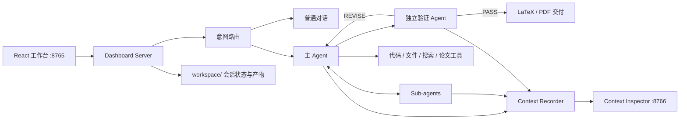

# Open Math Model Agent

一个本地优先的数学建模智能体工作台：从题目和材料导入开始，完成问题理解、建模、代码实验、论文写作、独立验证与 PDF 交付。

项目采用 Vite + React + TypeScript 构建前端，Python 负责 Agent 编排、文件处理、验证流程、LaTeX 论文生成和上下文审计。默认支持 DeepSeek，也可在设置中切换到 Kimi、MiniMax 或其他兼容 OpenAI Chat Completions 接口的服务。

## 主要功能

- AI-native 对话工作区：左侧会话历史、中间 Agent 对话、右侧协作计划/材料/关键决策/交付物/验证结果。
- 智能意图路由：普通闲聊直接回答；建模任务进入完整工作流。
- 多格式材料导入：支持 Markdown、文本、PDF、Word、Excel、CSV 和常见图片格式，并规范化为 `problem.md`、`data/` 与 `assets/`。
- 主 Agent 与 Sub-agent 协作：任务可以并行委派，主 Agent 分批收取已经完成的结果。
- 工具化研究流程：读取文件、执行代码、管理计划、联网检索、撰写论文、局部编辑论文、向用户提问等。
- 独立验证闭环：候选结果交给验证 Agent；未通过时返回证据与修改意见，最多验证指定轮数后按配置交付。
- LaTeX 论文流水线：Tectonic 编译、页数与摘要检查、公式/图表预检，以及最终 PDF 交付。
- 可中断、可继续的会话：停止后丢弃迟到的 API 结果，并从已持久化的状态继续。
- Markdown、GFM 表格、数学公式与代码块渲染。
- 上下文检查后台：单独查看每次模型请求中的系统提示、工作记忆、工具定义、用户输入、工具调用和工具结果。
- Token 与费用统计：区分缓存输入、非缓存输入和输出 Token；DeepSeek 默认按 `config.yaml` 中的人民币费率估算。

## 系统结构



## 环境要求

- Python 3.11 或更高版本
- Docker Desktop，用于隔离执行 Agent 生成的代码
- [Tectonic](https://tectonic-typesetting.github.io/)，用于把 LaTeX 论文编译为 PDF
- Node.js 20+ 与 pnpm，仅在修改前端源码时需要；仓库已经包含编译后的静态页面

## 快速开始

### 1. 克隆与安装

```bash
git clone git@github.com:patrlean/open-math-model-agent.git
cd open-math-model-agent

python3 -m venv .venv
source .venv/bin/activate
pip install -r requirements.txt
cp .env.example .env
```

在 `.env` 中至少填写一个模型服务的 API Key。默认配置使用 DeepSeek：

```dotenv
DEEPSEEK_API_KEY=your_api_key
```

### 2. 构建代码执行沙箱

```bash
docker build -t mathmodel-sandbox:latest mathmodel/sandbox
```

沙箱默认禁用网络，并对 Agent 运行的建模代码设置资源限制。

### 3. 启动主工作台

```bash
source .venv/bin/activate
python -m mathmodel.dashboard.server --port 8765
```

打开 [http://127.0.0.1:8765](http://127.0.0.1:8765)。

### 4. 启动上下文检查后台

在另一个终端运行：

```bash
source .venv/bin/activate
python -m mathmodel.context_inspector.server --port 8766
```

打开 [http://127.0.0.1:8766](http://127.0.0.1:8766)。该页面会显示模型实际接收的上下文，其中内容按以下类别整理：

1. System Prompt
2. Working Memory
3. Available Tool Definitions
4. User Input
5. Assistant Response / Tool Call / Tool Result

上下文日志可能包含完整题目、用户输入、工具参数和模型回复，请把它当作敏感数据，不要公开分享。

## 模型服务

可以在网页左下角的“设置”中更换服务商、模型、Base URL 和 API Key。密钥写入本机 `.env`，服务商、模型和 Base URL 元数据写入 `.provider-settings.json`；这两个本地配置均不会提交到 Git。

| 服务商 | 默认模型 | 默认 Base URL | 环境变量 |
| --- | --- | --- | --- |
| DeepSeek | `deepseek-v4-pro` | `https://api.deepseek.com` | `DEEPSEEK_API_KEY` |
| Kimi | `kimi-k2.6` | `https://api.moonshot.cn/v1` | `KIMI_API_KEY` |
| MiniMax | `MiniMax-M2.7` | `https://api.minimaxi.com/v1` | `MINIMAX_API_KEY` |
| OpenAI-compatible | 自定义 | 自定义 | `OPENAI_COMPATIBLE_API_KEY` |

联网检索默认优先使用 Brave Search；配置 `BRAVE_SEARCH_API_KEY` 后启用。未配置时会回退到 DuckDuckGo HTML 搜索。

## 输入材料与会话产物

建模任务开始后，上传材料会被整理为统一的工作区：

```text
workspace/<conversation-id>/
├── problem.md
├── data/
├── assets/
├── figures/
├── results/
├── paper/
│   ├── main.tex
│   └── main.pdf
├── events.jsonl
├── context_requests.jsonl
└── session_state.json
```

- PDF 中的文字会被提取，内嵌图片会保存到 `assets/`。
- Excel 工作表会规范化为 CSV，供 Agent 和代码沙箱读取。
- 图片材料目前会原样保存，但文字模型不会自动理解图片内容；需要 OCR 或视觉模型时应增加对应处理器。
- `workspace/` 包含本地会话、原始材料和生成产物，已在 `.gitignore` 中排除。

## 配置

全局默认值位于 [`config.yaml`](config.yaml)：

| 配置块 | 用途 |
| --- | --- |
| `provider` / `model` / `base_url` | 默认模型服务 |
| `context` | 上下文压缩阈值与 Token 来源 |
| `pricing` | 缓存输入、非缓存输入和输出的单价 |
| `web_search` | 搜索提供方、结果数量与超时 |
| `verification` | 是否验证、最大验证轮数、验证与修订步数 |
| `paper` | 目标页数、可接受页数、摘要和公式要求 |
| `sandbox` | 代码执行后端 |

默认论文目标为 20 页，可接受范围为 17–20 页。页面设置中的会话级参数会覆盖全局默认值。

## 前端开发

前端源码位于 `mathmodel/dashboard/frontend/`，包含主工作台和 Context Inspector 两个入口：

```bash
corepack enable
pnpm --dir mathmodel/dashboard/frontend install --frozen-lockfile
pnpm --dir mathmodel/dashboard/frontend build
```

构建产物会写入 `mathmodel/dashboard/static/`，Python 服务直接提供这些静态文件。

本地开发服务器：

```bash
pnpm --dir mathmodel/dashboard/frontend dev
```

## 检查与回归测试

项目在 `scripts/` 中保留了可直接运行的回归检查；它们是项目测试的一部分，不应加入 `.gitignore`。

```bash
python -m compileall -q mathmodel scripts
python -m scripts.check_ingest
python -m scripts.check_context
python -m scripts.check_context_inspector
python -m scripts.check_dashboard_conversations
python -m scripts.check_dashboard_interrupt_resume
python -m scripts.check_edit_paragraph
python -m scripts.check_verification_gate
python -m scripts.check_provider_switching
python -m scripts.check_usage_accounting
python -m scripts.check_latex
python -m scripts.check_sandbox
pnpm --dir mathmodel/dashboard/frontend build
```

部分检查需要 Docker、Tectonic 或有效的模型 API Key。

## 安全说明

- `.env`、本地服务商设置、运行工作区、日志、临时文件和前端依赖不会提交到 Git。
- 不要把 API Key 写入 `config.yaml`、源码、README 或测试文件。
- Dashboard 与 Context Inspector 默认只应绑定本机地址；当前项目没有面向公网部署所需的身份认证。
- Docker 沙箱默认禁用网络，但仍应审查资源限制后再用于不受信任的公开输入。
- 费用显示是基于 API 返回的 usage 字段与本地费率配置进行的估算，不等同于服务商账单。

## License

仓库目前尚未添加开源许可证。在正式添加 `LICENSE` 前，请不要将代码视为已获授权的开源软件。
