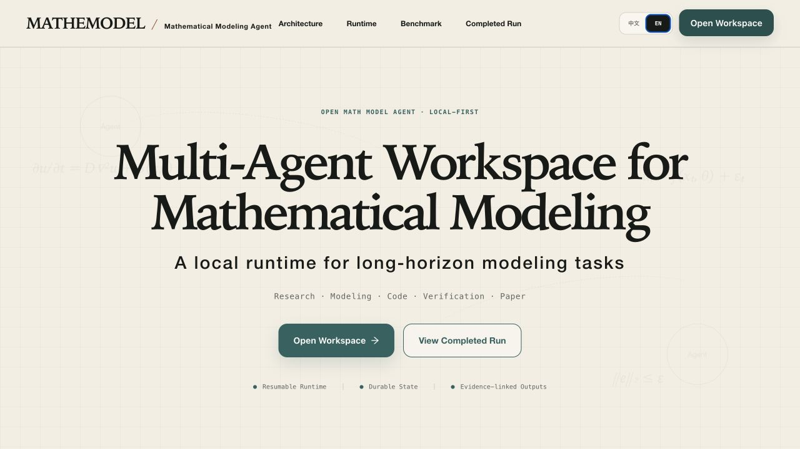
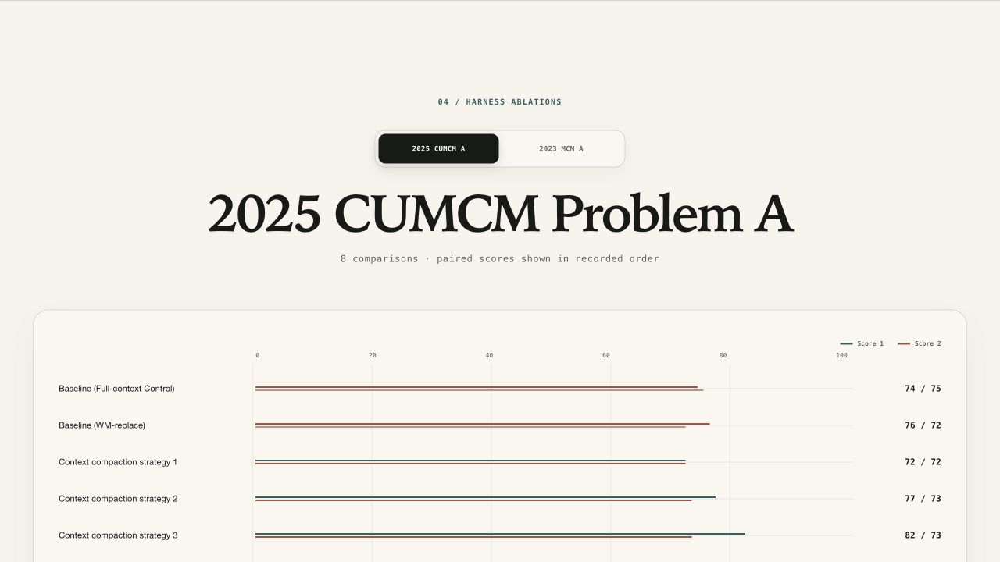
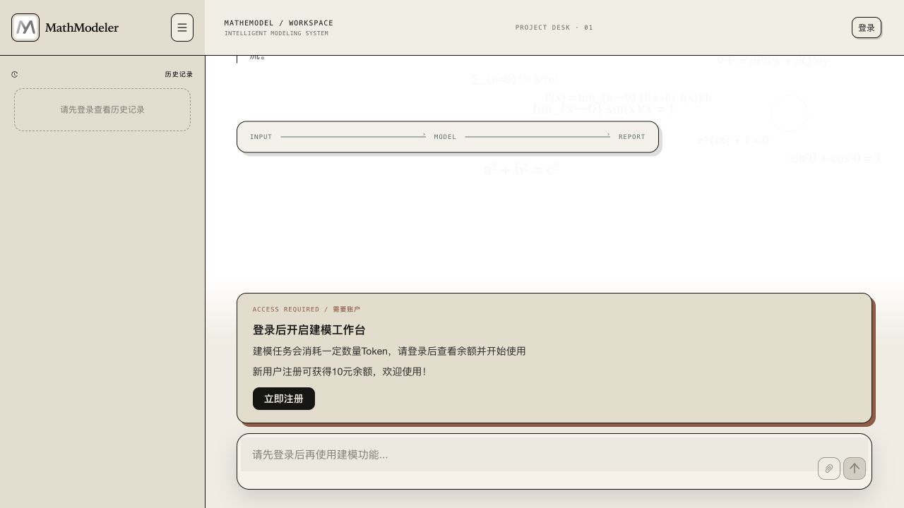
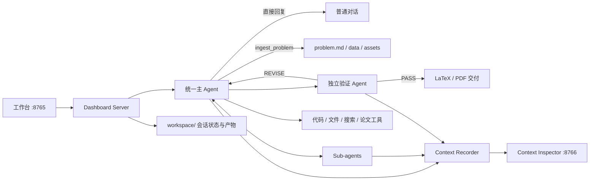

# Open Math Model Agent

[English](README.md) | **简体中文** | [产品网站](https://mathemodel.com/)

Open Math Model Agent 是一个本地优先的数学建模工作台。用户提供问题和相关材料后，Agent 可以完成问题分析、模型建立与实验、论文写作、结果验证，并交付最终 PDF。

<p align="center">
  <a href="https://mathemodel.com/"></a>
</p>

<p align="center">
  
  
</p>

可以访问 **[mathemodel.com](https://mathemodel.com/)** 体验在线版本，也可以按照下方说明在本机运行完整工作区。

## 主要功能

- 集中展示建模任务、材料、关键决策、执行进度和交付物的对话工作区。
- 支持导入 PDF、Word、Excel、CSV、Markdown、文本和图片材料。
- 主 Agent 可以委派 Sub-agent，协作完成建模、代码实验、研究和写作。
- 独立验证 Agent 会在交付前检查候选结果，并提供证据和修订意见。
- 支持中断与继续会话、中英文界面、上下文检查以及 Token 和费用统计。

## 工作流程



## Agent 核心能力

### 异步 Lead/Sub-agent 协作

`spawn_subagent` 会在后台启动一个边界明确的子任务并立即返回任务句柄。相互独立的建模、编程、检索和仿真任务可以在隔离的 Agent 上下文中并发运行；Sub-agent 只通过 `results/`、`figures/`、`src/` 等持久化文件与 Lead Agent 共享结果。

Lead Agent 不需要等待最慢的 Sub-agent。`collect_subagent_results(mode="first_completed")` 会在第一份新结果完成后立即返回，同时列出其他仍在运行的 Sub-agent 及其任务。Lead Agent 可以先检查结果、更新 Plan 或继续集成，剩余任务则保持后台运行；只有最终汇总与交付前才要求使用 `all_completed` 收齐全部结果。这样既实现异步推进，也不会把各个 Sub-agent 的调试轨迹塞入 Lead Agent 上下文。

### 持久化 Todo Plan 与决策状态

建模 Plan 是保存在 `plan.json` 中的结构化 Todo List，同时生成便于用户查看的 `plan.md`。`plan_write` 用于创建或重构任务列表，`set_task_status` 可以原子地更新单个任务，不需要 Agent 每次重写整个 Plan。重要假设、放弃的方法和关键决策会追加到 `decisions.md`，从而在上下文压缩或会话中断后继续保留。

这里需要区分两种状态：Plan 本身是可以更新的实时任务状态；当 Plan 变化时，系统不会回头修改模型历史消息，而是通过新的 Working Memory 快照传播最新状态。

### Append-only Working Memory 协议

在 `append_only` 模式中，第二条 System Message 是固定不变的 Working Memory Protocol，用于约定后续 Memory 的格式和解释方式。当持久化 Plan、Decision Log、结果索引或图表索引发生变化时，运行时会计算状态摘要，并在对话末尾追加一条带版本号的完整 Working Memory 快照。已经存在的 Protocol 和历史快照永远不会被修改，也不会在尚未闭合的 Tool Call/Tool Result 中间插入 Memory。

每条快照记录 Epoch、Version、SHA-256 摘要及其替代的旧版本；发生上下文压缩时进入新的 Epoch，并重新生成一条完整快照。这套设计一方面让中断恢复只需要读取最高版本快照，另一方面让请求前缀尽量保持稳定，从而提高服务端 Cache Hit。当前 2023 MCM A 实验中，Append-only Memory 的 Cache Hit Rate 为 88.8%，Replace 模式为 79.6%。完整协议见 [`docs/working-memory-protocol.md`](docs/working-memory-protocol.md)。

### 长时间工具的存活检测与异常恢复

模型 API 请求和工具执行都会每 30 秒写入一次持久化 Heartbeat，但 Heartbeat 不会作为消息加入模型上下文。Dashboard 使用 5 分钟的无活动阈值判断失联任务；只要运行线程仍然存在，或者 Heartbeat 仍在更新，即使计算持续数小时，也会保持 `running` 状态。

`run_code` 的单次最长执行时间为 7,200 秒。Docker 容器内部会执行 Wall-clock Timeout，主机侧同时每 0.25 秒检查进程状态和共享停止信号。发生超时或用户停止时，系统会同时终止主机进程组和对应容器，并把 `exit_code`、`timed_out`、执行时间、stdout/stderr 尾部以及完整日志路径作为普通 Tool Result 返回。正常工具超时不会把整轮会话标记为异常，Lead Agent 仍然可以分析失败原因并选择其他方法；未捕获的工具异常也会被转换成明确的错误结果，而不是直接让 Agent Loop 崩溃。

Session 会在每次模型请求之前以及每批 Tool Result 完成后持久化。如果 Dashboard 进程或电脑完全故障，正在执行的 Agent 无法凭空继续运行，但服务重新启动时会识别失去 Worker 的会话，只清理由该会话标签标识的 Docker 容器，并保留最后一个持久化边界供用户继续会话。

### 面向证据的论文交付与独立验证

论文引用的计算结果会写入结构化 `results/` 文件，最终可复现源码保存在 `src/`，图表与 LaTeX 内容继续关联这些产物。交付前可以由独立 Verification Agent 检查原始题目、源码、数值结果、图表和候选论文；验证不通过时，将结构化证据和修改意见返回 Lead Agent 继续修订，而不是直接接受模型的自我评价。

## 环境要求

- Python 3.11 或更高版本
- Docker Desktop，用于隔离执行 Agent 生成的代码
- [Tectonic](https://tectonic-typesetting.github.io/)，用于把 LaTeX 论文编译为 PDF
- Node.js 20+ 与 pnpm，仅在修改前端源码时需要；仓库已经包含编译后的静态页面

## 快速开始

### 1. 克隆与安装

```bash
git clone git@github.com:patrlean/open-math-model-agent.git
cd open-math-model-agent

python3 -m venv .venv
source .venv/bin/activate
pip install -r requirements.txt
cp .env.example .env
```

在 `.env` 中至少填写一个模型服务的 API Key。默认配置使用 DeepSeek：

```dotenv
DEEPSEEK_API_KEY=your_api_key
```

### 2. 构建代码执行沙箱

```bash
docker build -t mathmodel-sandbox:latest mathmodel/sandbox
```

沙箱默认禁用网络，并对 Agent 运行的建模代码设置资源限制。

### 3. 启动主工作台

```bash
source .venv/bin/activate
python -m mathmodel.dashboard.server --port 8765
```

打开 [http://127.0.0.1:8765](http://127.0.0.1:8765)。

### 4. 启动上下文检查后台

在另一个终端运行：

```bash
source .venv/bin/activate
python -m mathmodel.context_inspector.server --port 8766
```

打开 [http://127.0.0.1:8766](http://127.0.0.1:8766)。该页面会显示模型实际接收的上下文，并按以下类别整理：

1. System Prompt
2. Working Memory Protocol 与带版本号的快照
3. Available Tool Definitions
4. User Input
5. Assistant Response / Tool Call / Tool Result

上下文日志可能包含完整题目、用户输入、工具参数和模型回复，请把它当作敏感数据，不要公开分享。

默认的 `append_only` Working Memory 模式会保留不可变协议，并只在持久状态变化时追加完整快照。协议详见
[`docs/working-memory-protocol.md`](docs/working-memory-protocol.md)；如需旧机制对照组，可设置
`context.working_memory_mode: replace`。

## 模型服务

可以在网页左下角的“设置”中配置服务商、Base URL 和 API Key；DeepSeek 的 Flash/Pro 模型与 Low/High/Max 思考强度在发送按钮旁切换。密钥写入本机 `.env`，服务商元数据写入 `.provider-settings.json`；这两个本地配置均不会提交到 Git。

| 服务商 | 默认模型 | 默认 Base URL | 环境变量 |
| --- | --- | --- | --- |
| DeepSeek | `deepseek-v4-flash`（默认）/ `deepseek-v4-pro` | `https://api.deepseek.com` | `DEEPSEEK_API_KEY` |
| Kimi | `kimi-k2.6` | `https://api.moonshot.cn/v1` | `KIMI_API_KEY` |
| MiniMax | `MiniMax-M2.7` | `https://api.minimaxi.com/v1` | `MINIMAX_API_KEY` |
| OpenAI-compatible | 自定义 | 自定义 | `OPENAI_COMPATIBLE_API_KEY` |

联网检索默认优先使用 Brave Search；配置 `BRAVE_SEARCH_API_KEY` 后启用。未配置时会回退到 DuckDuckGo HTML 搜索。

图片材料由主 Agent 的 `describe_image` 工具调用 `kimi-k3` 识别。请配置
`MOONSHOT_API_KEY`；Kimi 的缓存命中输入、缓存未命中输入、输出 token 和人民币费用
都会计入会话用量与修改预算。模型及调用上限可在 `config.yaml` 的 `vision` 段配置。

## 输入材料与会话产物

每个建模会话都有独立的工作区：

```text
workspace/<conversation-id>/
├── problem.md
├── data/
├── assets/
├── figures/
├── results/
├── paper/
│   ├── main.tex
│   └── main.pdf
├── events.jsonl
├── context_requests.jsonl
└── session_state.json
```

- PDF 中的文字会被提取，内嵌图片会保存到 `assets/`。
- Excel 工作表会规范化为 CSV，供 Agent 和代码沙箱读取。
- 图片材料目前会原样保存，但文字模型不会自动理解图片内容；需要时应增加 OCR 或视觉处理器。
- `workspace/` 包含本地会话、原始材料和生成产物，已在 `.gitignore` 中排除。

## 配置

全局默认值位于 [`config.yaml`](config.yaml)：

| 配置块 | 用途 |
| --- | --- |
| `provider` / `model` / `base_url` | 默认模型服务 |
| `context` | 上下文压缩阈值与 Token 来源 |
| `pricing` | 缓存输入、非缓存输入和输出的单价 |
| `web_search` | 搜索提供方、结果数量与超时 |
| `verification` | 是否验证、最大验证轮数、验证与修订步数 |
| `paper` | 目标页数、可接受页数、摘要和公式要求 |
| `sandbox` | 代码执行后端 |

默认论文目标为 20 页，可接受范围为 17–20 页。页面设置中的会话级参数会覆盖全局默认值。

## 前端开发

前端源码位于 `mathmodel/dashboard/frontend/`，包含主工作台和 Context Inspector 两个入口：

```bash
corepack enable
pnpm --dir mathmodel/dashboard/frontend install --frozen-lockfile
pnpm --dir mathmodel/dashboard/frontend build
pnpm --dir mathmodel/dashboard/frontend exec vite build --config vite.experiment.config.ts
```

第一条构建命令生成主工作台与 Context Inspector，第二条生成独立的 Experimental Inspector；两者都会把静态资源写入 `mathmodel/dashboard/static/`，再由对应的 Python 服务直接提供。

本地开发服务器：

```bash
pnpm --dir mathmodel/dashboard/frontend dev
```

## 独立 Benchmark 实验

实验入口不需要启动 `localhost:8765`，并且每次提交都会冻结当前后端源码、运行配置和 benchmark 输入。已经开始的实验会继续使用自己的快照；修改 Agent 后可以立即提交下一轮，两轮互不影响。

先检查每道题的 `problem/` 目录都有材料：

```bash
./.venv/bin/python -m mathmodel.experiment cases
```

提交固定 benchmark 中的全部题目（默认同一道题的两次运行并行、主 Agent 200 步、关闭内置验证以便后续交给外部评分器）：

```bash
./.venv/bin/python -m mathmodel.experiment submit --label before-prompt-change
```

修改 Agent 后可以立刻再次提交：

```bash
./.venv/bin/python -m mathmodel.experiment submit --label after-prompt-change
```

提交命令会立即返回实验 ID。查看实验列表、状态和单题实时日志：

```bash
./.venv/bin/python -m mathmodel.experiment list
./.venv/bin/python -m mathmodel.experiment status <experiment-id>
./.venv/bin/python -m mathmodel.experiment logs <experiment-id> --case 2023MCM_A-run-1 --follow
```

默认情况下，每道 benchmark 题目会进行两次完全独立且并行的运行，分别保存在 `<case>-run-1` 和 `<case>-run-2`；两次运行拥有各自的 workspace、进程、日志和产物。默认两个 Worker 会先同时执行第一道题的两遍，再同时执行下一道题的两遍。实验保存在 `experiments/<experiment-id>/`。`manifest.json` 记录 Git 版本、工作区是否有未提交改动、源码哈希、模型配置和各次运行状态；每次运行的 `workspace/` 保存论文、结果、图表、完整 `events.jsonl`、模型请求上下文和最终摘要。若希望把内置验证也纳入实验，可在提交时增加 `--with-verification`。

需要冻结另一份实验配置时使用 `--config path/to/config.yaml`；需要控制运行单元并行数时使用 `--max-workers 1`（串行）或其他正整数。特殊情况下可以用 `--repetitions N` 调整每道题的独立运行次数，默认值为 2。

## 实验与消融研究

项目目前包含 11 组已经完成且可由外部 Evaluator 评分的 Agent Harness 实验。主要消融维度包括 Working Memory 组织方式、独立验证、上下文压缩结构、历史推理保留、工具结果外置，以及基于执行 Checkpoint 的分层裁剪。

下表评分**仅包含 2023 MCM A**。这些分数来自项目作者提供的独立 Evaluator 记录，并非由 `manifest.json` 自动生成。每组实验生成两篇独立论文；若同一篇论文接受了多次评分，则先计算该论文的评分均值，再计算两篇论文的实验均值。

| 实验 | 修改或检验的结构 | 结果状态 | 2023 MCM A 得分 |
| --- | --- | --- | ---: |
| 初始 Agent Baseline | 后续 Working Memory 与上下文策略实验之前的初始端到端 Harness | 完成 | 73.75 |
| Append-only Baseline | 更新后的 Lead/Sub-agent Harness；使用 Append-only Working Memory，关闭独立验证 | 完成 | 92.42 |
| Working Memory Replace | 原位置替换可变 Working Memory，而不是追加带版本号的快照 | 完成 | 93.00 |
| With Verification | 在 Append-only Working Memory 基础上启用独立验证与修订闭环 | 完成 | 90.83 |
| Monolithic Summary 256k | 上下文达到 256k 后将较早历史整体总结，并保留最近 10 条消息 | 完成 | 86.50 |
| Split User/Agent Summary 256k | 用户历史保持原文，较早的 Agent 推理与工具活动单独总结 | 完成 | 83.00 |
| Incremental Summary + Preserve Thinking | 增量追加摘要，但仍保留历史推理与工具轨迹 | 完成 | 83.50 |
| Incremental Summary | 只总结本次新增的待压缩轨迹，以增量方式追加摘要并保留最近 10 条消息 | 完成 | 82.75 |
| Externalized Tool Results | 将较大的历史 Tool Result 保存到工作区文件，上下文仅保留引用和短预览 | 完成 | 82.00 |
| Full-context Control | 将压缩阈值提高到 1M Token，作为近似不压缩完整历史的对照 | 完成 | 66.50 |
| Checkpoint + Tool Pruning V2 | 在 166.4k/204.8k 对旧 Tool Result 按可恢复性分级裁剪，在 256k 生成执行 Checkpoint，并保留最近 10 条消息 | 完成 | 88.75 |

<details>
<summary>独立 Evaluator 原始评分记录</summary>

| 实验 | 论文/运行 1 的评分 | 论文/运行 2 的评分 | 实验均分 |
| --- | --- | --- | ---: |
| 初始 Agent Baseline | 77、83 | 63、70.5、69 | 73.75 |
| Append-only Baseline | 88、91.5、95 | 95、92、93 | 92.42 |
| Working Memory Replace | 94 | 92 | 93.00 |
| With Verification | 95、89、88.5 | 93、92.5、87 | 90.83 |
| Monolithic Summary 256k | 86 | 87 | 86.50 |
| Split User/Agent Summary 256k | 84 | 82 | 83.00 |
| Incremental Summary + Preserve Thinking | 84 | 83 | 83.50 |
| Incremental Summary | 82、91.5 | 75、82.5 | 82.75 |
| Externalized Tool Results | 83 | 81 | 82.00 |
| Full-context Control | 57 | 76 | 66.50 |
| Checkpoint + Tool Pruning V2 | 91 | 86.5 | 88.75 |

</details>

### 当前 2023 Benchmark 的主要发现

- Evaluator 对同一篇论文重复评分的合并标准差为 **3.9 分**（相对标准差为 **4.6%**）；11 组实验均分的标准差为 **8.0 分**（相对标准差为 **9.6%**）。Evaluator 噪声不可忽略，但小于当前观察到的 Harness 配置间差异。
- Append-only Working Memory 的 Cache Hit Rate 为 **88.8%**，较 Replace 模式高 9.2 个百分点，同时质量基本持平（92.42 vs. 93.00）。
- Checkpoint + Tool Pruning V2 将两次 2023 运行的累计 API Token 从强 Append-only Baseline 的 63.70M 降至 34.96M，降低 **45.1%**；Evaluator 得分降低 3.67 分，相对下降约 **4.0%**。
- 保留历史推理轨迹会抵消上下文压缩效果：该策略累计消耗 78.26M Token，触发 149 次压缩，Cache Hit Rate 仅为 27.3%。
- 目前不能把独立验证描述为带来确定的因果增益：验证组两篇论文的均分均为 90.83，体现了稳定的 90+ 质量，但实验均分比关闭验证的 Append-only Baseline 低 1.58 分。仍需增加 Benchmark 题目和重复次数，才能可靠估计验证机制的实际效果。

以上比较属于探索性结论，而不是最终排行榜。多数实验仅包含两篇生成论文；部分论文接受过多次评价，另一些只有一次评价；部分历史实验之间还存在源码快照变化。每组本地 `experiments/<experiment-id>/manifest.json` 中冻结的源码哈希和运行配置才是权威的追溯记录。实验工作区与模型日志可能包含 Benchmark 材料，因此不会随仓库公开发布。

### Experimental Inspector

启动独立、只读的实验可视化页面：

```bash
./.venv/bin/python -m mathmodel.experimental_inspector.server --port 8767
```

打开 [http://127.0.0.1:8767](http://127.0.0.1:8767)。页面会实时显示实验与两道题状态、Agent 时间线、工具调用、Token 用量、计划、决策、产物、控制台日志，并把 Main Agent 和各个 Sub-agent 的 Context 请求分别汇总展示。Inspector 只读取 `experiments/`，不会启动、停止或修改实验。

Benchmark 目录约定如下；可在 case 根目录放置可选的 `task.md` 覆盖默认实验指令：

```text
benchmark-v1/
├── first-case/
│   ├── task.md            # optional
│   └── problem/           # PDF / Word / Excel / CSV / text / images
└── second-case/
    └── problem/
```

## 检查与回归测试

项目在 `scripts/` 中保留了可直接运行的回归检查；它们是项目测试的一部分，不应加入 `.gitignore`。

```bash
python -m compileall -q mathmodel scripts
python -m scripts.check_ingest
python -m scripts.check_context
python -m scripts.check_context_inspector
python -m scripts.check_competition_paper_profiles
python -m scripts.check_experiment_runner
python -m scripts.check_experimental_inspector
python -m scripts.check_dashboard_conversations
python -m scripts.check_dashboard_interrupt_resume
python -m scripts.check_edit_paragraph
python -m scripts.check_verification_gate
python -m scripts.check_provider_switching
python -m scripts.check_usage_accounting
python -m scripts.check_latex
python -m scripts.check_sandbox
pnpm --dir mathmodel/dashboard/frontend build
```

部分检查需要 Docker、Tectonic 或有效的模型 API Key。

## 更新日志

### 尚未发布

- 增加中英文界面，并将英文设置为默认语言。
- 增加中英文项目文档和 README 语言切换入口。
- 项目采用 Apache License 2.0 开源许可证。
- 增加可持久化的比赛页数档案：国赛目标 20 页，美赛目标 25 页并验收 24–25 页。
- 补充 11 组已完成 Harness 实验、2023 MCM A 外部评分记录及上下文管理消融结论。
- 将异步 Sub-agent 回收、持久化 Plan、Append-only Working Memory 和长时间工具异常恢复补充为 Harness 核心能力。

### 2026-07-30

- 补充项目文档并优化上下文时间线的展示方式。

### 2026-07-29

- 发布 Open Math Model Agent 工作台的初始版本。

## 安全说明

- `.env`、本地服务商设置、运行工作区、日志、临时文件和前端依赖不会提交到 Git。
- 不要把 API Key 写入 `config.yaml`、源码、README 或测试文件。
- Dashboard 与 Context Inspector 默认只应绑定本机地址；当前项目没有面向公网部署所需的身份认证。
- Docker 沙箱默认禁用网络，但仍应审查资源限制后再用于不受信任的公开输入。
- 费用显示是基于 API 返回的 usage 字段与本地费率配置进行的估算，不等同于服务商账单。

## License

本项目采用 [Apache License 2.0](LICENSE)。在遵守许可证条款的前提下，可以使用、修改和分发本项目，也可以用于商业用途。
